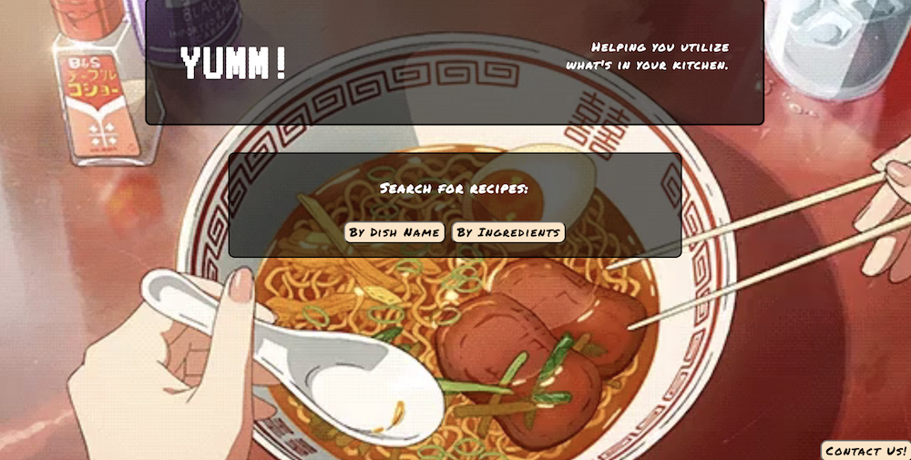

# YUMM! #

## An interactive app that allows users to search for new recipes and utilize ingredients they already have. ##

---

### Screenshots

#### Landing page:

#### Search:

#### Search Results:

#### Contact Form:

---

### Built With:

* HTML
* CSS
* Javascript
* JQuery

---

### Features:
* Search for recipes by dish name
* Search for recipes by list of ingredients
* Results return preview image and recipe URL that opens in a new window
* Contact form in case of any user questions or concerns

---

### Link to Live App:

[YUMM] (https://madd-ison.github.io/yumm/)
